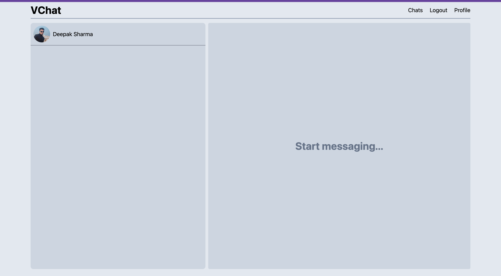
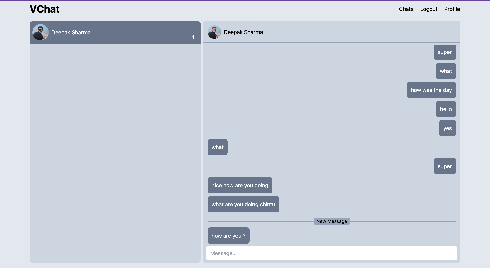

# VChat - A Real-Time Chat Application

VChat is a real-time chat application that I have created using Next.js 13 and TailwindCSS. The application allows users to chat with each other in real-time, receive new messages, and differentiate between read and unread messages. Firebase is used as the backend for this project, which provides reliable and fast real-time data synchronization.

## Features

- Real-time chat: Users can talk in real-time, and messages are delivered instantly to the recipient.

- Read and unread messages: Users can easily differentiate between read and unread messages, making it easy to keep track of new messages.

- Firebase integration: Firebase provides reliable and fast real-time data synchronization, making the chat experience smooth and seamless.

- Responsive design: The application is designed to work on all devices, from desktop computers to mobile phones.

- Clean and modern UI: The user interface of VChat is clean, modern, and easy to use, providing a seamless chat experience.

Overall, VChat is a great option for anyone looking for a simple and reliable chat application that is easy to use and works seamlessly in real-time.
